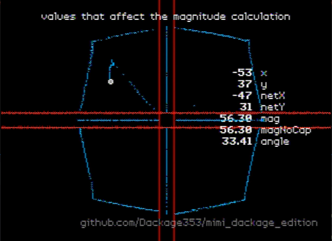
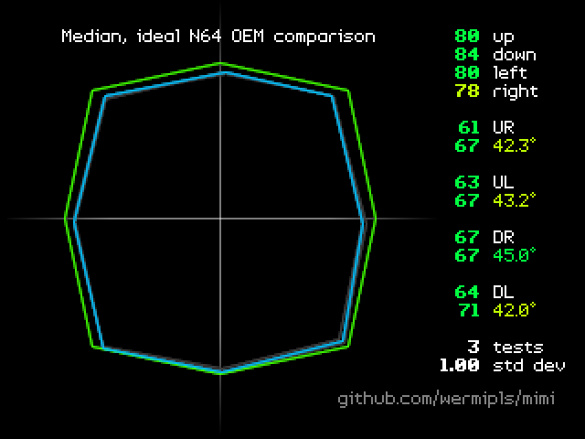

Fork of wermi's mimi z64 that is used to test controller angles.

Adds a SM64 magnitude testing mode.

This works on console but not on most emulators.
This emu works with it:
https://simple64.github.io/

See the main fork for real information.