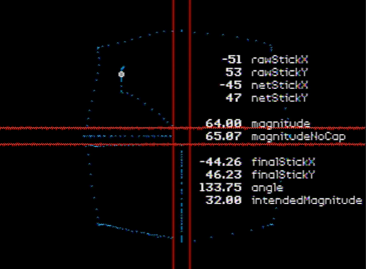
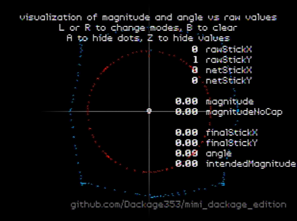
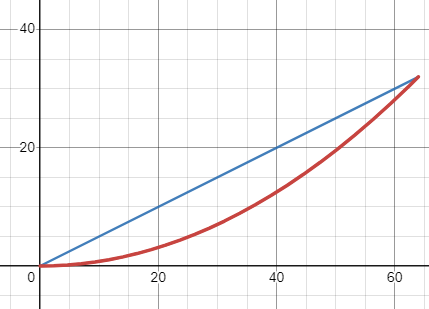

## mimi dackage edition

 
This is a fork of wermi's mimi N64 ROM that is used to test controller angles.

It adds a magnitude testing mode that demonstrates how stick values and magnitude works in SM64.

## Download
https://github.com/Dackage353/mimi_dackage_edition/releases

## How to Use
The z64 file works on console with an everdrive but not on most emulators.

This emu works with it:
https://simple64.github.io/

Simply select the "SM64 magnitude test" on the menu to get started. Move the joystick around to see a visualization of how the stick values and magnitude work in this game.

Press L or R to change modes, B to clear, A to hide dots, Z to hide values, Start to exit

## Explanation of the Variables from the adjust_analog_stick Function
- rawStickX, rawStickY, netStickX, netStickY are all signed bytes so they have a minimum value of -128 and a maximum of 127.
- magnitudeNoCap, magnitude, finalStickX, finalStickY, intendedMagnitude, angle are all floats.

- rawStickX and rawStickY are the raw stick values given by the controller.
- netStickX and netStickY are the raw stick values that have a deadzone of 7. Also their values are increased/decreased by up to 6. Note that net stick values of 1 are impossible.
- magnitudeNoCap is a result of the magnitude calculation of sqrt(netStickX^2 + netStickY^2)
- magnitude is magnitudeNoCap but capped at 64.
- finalStickX and finalStickY are the final intended values calculated by netStickX * 64 / magnitude and netStickY * 64 / magnitude. 
- The decomp code of this function can be found here: https://github.com/n64decomp/sm64/blob/1372ae1bb7cbedc03df366393188f4f05dcfc422/src/game/game_init.c#L425-L460

## Explanation of the Variables from the update_mario_joystick_inputs Function

- intendedMagnitude is calculated by (magnitude / 64)^2 * 64 / 2. This is used to calculate Mario's target speed. Note that Mario's run speed and the maximum intendedMagnitude are both 32.
- The curve of this formula can be visualized here:
 

 
- The x-axis is the magnitude while the y-axis is the resulting intendedMagnitude.
- The red line is the intendedMagnitude formula while the blue line is probably what most would expect how it would work.
- Because of this curvature, the intendedMagnitude increases slowly at first and then increases more rapidly as it goes right.

- angle is calculated with the function atan2(finalStickY, finalStickX). The ingame calculation adds the camera to this as well. For simplicity I converted the angle to degrees.
- The decomp code of this function can be found here: https://github.com/n64decomp/sm64/blob/9921382a68bb0c865e5e45eb594d9c64db59b1af/src/game/mario.c#L1293-L1309

## Modes
There are 2 modes. The first is the visualization of the SM64 ingame deadzone. 
- In this mode the location of the white cursor represents your stick values but values in between the red lines are ignored.
- Since values in between -8 and 8 are ignored, the horizontal red lines mark the deadzone of your y-value. The vertical red lines mark the deadzone of your x-value.
- The square in the middle is the complete deadzone where your magnitude will be zero.

The second is a visualization of the magnitude and angle calculation vs raw joystick values.
- The white cursor represents your raw stick values (no deadzone)
- The red cursor is a representation of your magnitude and angle.